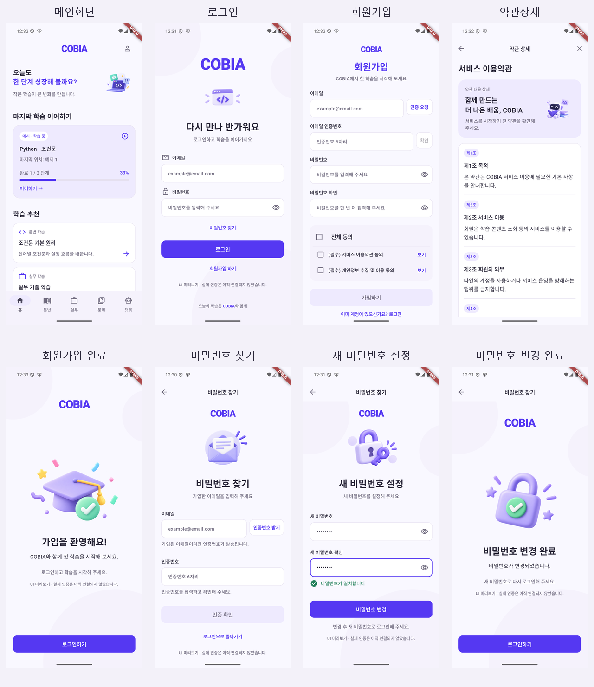

# 담당 화면 UI 수정

기준 브랜치 `develop`의 `10b189a`를 반영한 뒤 `feature/auth-home-ui-revision`에서 작업했습니다.

## 범위

메인화면, 로그인, 회원가입, 약관상세, 회원가입 완료, 비밀번호 찾기, 새 비밀번호 설정, 비밀번호 변경 완료만 수정했습니다. 다른 팀원의 문법·실무·문제·챗봇·마이페이지 및 공통 하단 내비게이션·전역 테마·라우터는 변경하지 않았습니다. 공통 변경은 담당 화면용 토큰과 사용자에게 보이는 앱 이름(COBIA)뿐입니다. 저장소·내부 패키지 이름은 유지했습니다.

## 변경 내용

- [COBIA 플루터 UI 컨벤션](https://app.notion.com/p/COBIA-UI-3ed976bb7a2d8017a207c8e68d6e78e7)의 2026-10-02 20:09 KST 수정본을 적용했습니다.
- `lib/app/app_ui_tokens.dart`의 색상·간격·글꼴·모서리·라이트 테마를 담당 8개 화면에만 적용했습니다. 주요 색상은 `#5538F2`, 배경은 `#F9F8FF`, 입력은 흰 배경과 기본 1px/포커스·오류 2px 테두리입니다.
- 화면 여백은 320 너비에서 16, 360 이상에서 20, 큰 화면 본문은 최대 560입니다. 입력·버튼은 최소 높이, 아이콘 터치 영역은 최소 48×48로 설정했습니다.
- 로그인 링크 순서, 처리 중 스피너·중복 제출 방지, 키보드 다음/완료, 이메일 변경 시 인증 해제와 재전송 시 코드 초기화를 적용했습니다.
- 회원가입 완료는 자동 로그인/홈 이동 대신 `로그인하기`로 이동합니다. 비밀번호 재설정은 단계별 제목과 뒤로가기를 제공하며 완료 후 로그인으로 이동합니다.
- 약관은 제목·설명·전문·닫기를 한 페이지에서 스크롤하도록 바꿔 200% 글씨·가로 화면의 넘침을 해결했습니다. 닫아도 회원가입의 입력·동의 상태는 유지됩니다.
- 홈은 예시 학습 기록을 명시하고 완료/전체 단계로 진도율을 계산합니다. 이어하기는 Python 조건문의 첫 예제로, 세 추천 카드는 기존 문법·실무·문제 경로로 연결합니다. 실제 학습 이력 복원은 서버 연결 전까지 제공하지 않습니다.
- 일러스트의 보라색 3D 스타일을 유지하고 이미지 실패 대체 표시를 추가했습니다.
- PDF에 포함된 저해상도 이미지 대신 참고 이미지 기반 고해상도 일러스트를 생성했습니다. 원본 자산의 정확한 복제본은 아니며, [자산 설명과 생성 프롬프트](../assets/images/auth/README.md)에 기록했습니다.

## 실제 화면

Android 에뮬레이터의 최종 debug APK에서 캡처했습니다.
스크롤 화면의 첫 프레임을 모은 이미지이며, 홈의 세 번째 추천 카드와 약관 하단 닫기 등은 스크롤하면 표시됩니다.

[메인화면](screenshots/ui-revision/home.png) · [로그인](screenshots/ui-revision/login.png) · [회원가입](screenshots/ui-revision/sign-up.png) · [약관상세](screenshots/ui-revision/terms.png) · [회원가입 완료](screenshots/ui-revision/sign-up-complete.png) · [비밀번호 찾기](screenshots/ui-revision/password-reset.png) · [새 비밀번호 설정](screenshots/ui-revision/new-password.png) · [비밀번호 변경 완료](screenshots/ui-revision/password-reset-complete.png)

약관의 실제 Android 작은 화면·큰 글씨 검사: [320×640 / 200% 상단](screenshots/ui-revision/terms-320-200.png) · [본문 끝과 닫기](screenshots/ui-revision/terms-320-200-bottom.png). 검사 후 해상도와 글씨 크기를 원래 설정으로 복원했습니다.

## 검증

- 프로젝트 내부 `.tools/flutter` SDK와 내부 캐시를 사용한 `flutter pub get` 완료
- `dart format` 완료
- `flutter analyze --no-pub` 통과
- `flutter test test/app_test.dart --no-pub`: 56개 통과
- `flutter build apk --debug --no-pub` 통과
- Android 에뮬레이터에서 로그인 → 홈, 회원가입 → 약관상세 → 인증 → 가입 완료 → 로그인, 비밀번호 찾기 → 인증 → 새 비밀번호 → 변경 완료 → 로그인 흐름을 확인했습니다.
- 360×800, 320×640, 글씨 200%, 키보드, 가로 640×320 및 가로 키보드의 담당 화면 검사 통과. 약관 닫기 접근, 새 비밀번호 입력·일치·단계 뒤로가기, 완료 화면 이동, 홈 경로 연결을 추가 검사했습니다.
- 전체 `flutter test --no-pub`: 75개 통과, 7개 실패
  - `grammar_chapters_test.dart` 6개, `grammar_quiz_test.dart` 1개
  - 변경하지 않은 기준 커밋 `10b189a`에서도 같은 7개 실패를 재현했습니다. 다른 팀원의 테스트와 구현은 수정하지 않았습니다.

## 남은 경계

- 로그인·이메일 인증·회원가입·비밀번호 변경은 기존 프론트 시뮬레이션이며 화면에 UI 미리보기 안내를 표시합니다. 6자리 코드는 형식만 검사하며 실제 발송/검증/저장을 하지 않습니다.
- 서버 계약 미제공: 계정 오류·메일 전송 실패·코드 만료·네트워크 오류의 실제 응답, 인증 만료/재전송 간격, 비밀번호 정책, 약관 동의 시각 저장, 성공 응답에 따른 완료 처리와 공유 로그인/학습 상태의 Provider 연동은 미완료입니다. 임의 정책·시간·API를 만들지 않았습니다.
- 약관은 기존 예시 내용입니다. 최종 서비스 약관과 개인정보 처리방침은 별도 제공이 필요합니다.
- 생성 일러스트는 원본 자산을 제공받으면 같은 파일명으로 교체할 수 있습니다.
- 이 문서와 실제 화면 캡처를 UI 수정 PR의 검증 근거로 제공합니다.
