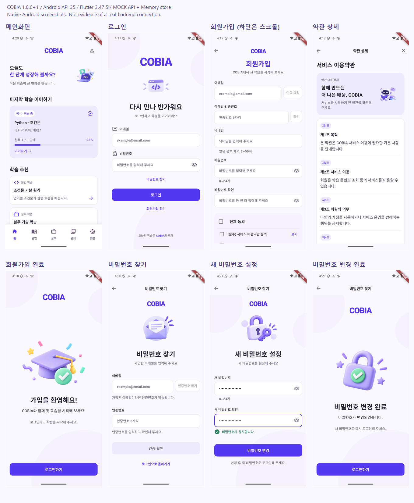

# 인증 API 연동 작업 기록

## 기준과 범위

- 확인일: 2026-10-10, 분리 작업 브랜치: `feature/auth-api-core`, `feature/auth-screen-integration`, `docs/auth-api-verification`
- 작업 시작 시 원격 develop 확인: FE `e6dd2ee`, BE `a3380c8`
- BE README, `docs/auth-api.md`, `docs/auth-fe-alignment.md`를 실제 Controller·DTO·Service와 대조했습니다. 비밀번호 재설정 Controller는 최신 develop에 이미 포함되어 있습니다.
- FE PR #8과 `docs/learning-ui-revision.md`의 공통 UI를 유지했습니다. 홈·인증 배경, 디자인 토큰, 흰색/그림자 하단바를 바꾸지 않았습니다.
- 문법·실무·문제·챗봇 운영 코드에는 변경이 없습니다. 기존 테스트에는 보호 경로 접근에 필요한 인증 fixture만 주입했습니다.
- 마이페이지는 로그인 응답의 닉네임·이메일·역할 표시와 로그아웃만 연결했습니다. 가입일은 서버 응답에 없어 임시 날짜를 실제 정보처럼 표시하지 않습니다. 학습 활동 데이터는 기존 샘플입니다.
- 인증 기반 → 화면 연결·회귀 테스트·캡처 → 실행·검증 문서 순서로 분리합니다. 병합·배포는 진행하지 않았습니다.

### 분리 검토 순서

| 단위 | head | base | 검토 범위 |
| --- | --- | --- | --- |
| 1 | `feature/auth-api-core` | `develop` | 의존성·Android 설정, API·세션·이메일 인증, 단위 테스트 |
| 2 | `feature/auth-screen-integration` | `feature/auth-api-core` | 화면·라우터 연결, 인증 fixture, 화면 회귀 테스트, 캡처 |
| 3 | `docs/auth-api-verification` | `feature/auth-screen-integration` | README와 이 검증 기록 |

후속 PR은 앞 브랜치를 기준으로 중복 diff를 제외합니다. 선행 PR 병합 후 후속 PR의 base를 `develop`으로 변경해야 합니다. 현재 CI의 `pull_request` 대상은 `main`·`develop`만이며, 후속 feature/docs 브랜치는 `push` 이벤트에서 검증합니다. CI에는 전체 테스트 단계가 없으므로 아래 로컬 테스트 결과를 별도로 확인합니다.

## 구현 파일

| 위치 | 역할 |
| --- | --- |
| `lib/features/auth/data/auth_api.dart` | 9개 POST API, 응답 모델, 상태/네트워크 오류 안내 |
| `lib/features/auth/data/token_store.dart` | 네이티브 보안 저장소의 세션 읽기·쓰기·삭제 |
| `lib/features/auth/presentation/auth_view_model.dart` | Provider 세션, 복원·로그인·단일 갱신·401 1회 재시도·로그아웃 |
| `lib/features/auth/presentation/email_verification_view_model.dart` | 이메일/재설정 인증, 서버 TTL, 재전송, 늦은 응답 무시, 일회용 resetToken |
| `lib/features/auth/presentation/{login,sign_up,password_reset}_screen.dart` | 입력·필드 오류·중복 제출 제한·실제 성공 응답 이후 화면 이동 |
| `lib/features/auth/presentation/auth_validators.dart` | 닉네임 2~50자, 이메일 255자, 비밀번호 8~64자 |
| `lib/features/auth/presentation/auth_widgets.dart` | 모의 인증 성공 안내 제거, 기존 UI 유지 |
| `lib/app/cobip_app.dart`, `lib/app/router/app_router.dart` | 세션 Provider와 보호 경로/복원 대기 |
| `lib/features/my_page/presentation/my_page_screen.dart` | 실제 로그인 사용자 표시와 로그아웃 |
| `pubspec.yaml`, `pubspec.lock` | Dio 및 flutter_secure_storage |
| `android/app/src/{main,debug}/AndroidManifest.xml` | 인터넷 권한, 보안 저장소 백업 제외, 개발 빌드에만 HTTP 허용 |
| `test/auth_*`, `test/email_verification_test.dart`, 기존 화면 테스트 | 계약·경쟁 상태·화면 흐름·반응형·팀 UI 회귀 |
| `README.md`, 이 문서 | 환경 설정과 검증 경계 |

## API 계약

모든 경로는 POST이며 `API_BASE_URL`에 호스트를 전달합니다. 비밀번호 확인값은 서버로 보내지 않습니다. 인증 코드는 `012345`처럼 6자리 문자열을 그대로 전달합니다.

| 경로 | 요청 | 성공 |
| --- | --- | --- |
| `/api/auth/email-verifications/send` | email | 202, message/expiresInSeconds/resendAfterSeconds |
| `/api/auth/email-verifications/confirm` | email, code | 200, verified=true |
| `/api/auth/register` | email, nickname, password, serviceTermsAgreed, privacyTermsAgreed | 201, 사용자 정보만 반환 |
| `/api/auth/login` | email, password | 200, 두 토큰·사용자·accessExpiresInSeconds |
| `/api/auth/refresh` | refreshToken | 200, 두 토큰 회전 |
| `/api/auth/logout` | refreshToken + Bearer accessToken | 204, 빈 본문 |
| `/api/auth/password-resets/send` | email | 202, 발송/재전송 TTL |
| `/api/auth/password-resets/confirm` | email, code | 200, resetToken/expiresInSeconds |
| `/api/auth/password-resets/complete` | resetToken, newPassword | 204, 빈 본문 |

가입은 이메일 서버 인증, 공백 제거한 닉네임, 비밀번호·확인 일치, 두 필수 약관 동의가 모두 필요합니다. 409 `NICKNAME_ALREADY_USED`는 닉네임 필드에 표시합니다. 201 이후 가입 완료→로그인 흐름이며 자동 로그인하지 않습니다.

코드 만료·재전송은 서버 응답의 초 단위 값을 사용합니다. 확인 응답에 별도 TTL이 없는 이메일 인증 완료 30분과 refresh 14일은 대조한 서버 계약을 따릅니다. access 만료는 응답값으로 계산합니다. 5회 INVALID_CODE 이후에는 재전송이 필요합니다. 이메일 변경·재전송·화면 종료 시 이전 응답을 현재 인증으로 적용하지 않습니다.

토큰은 비밀번호·인증 코드 없이 한 세션 JSON으로 보안 저장소에 보관합니다. 갱신은 single-flight이며 토큰 두 개를 함께 교체합니다. 앱 재시작 때 서버 갱신을 확인하고 보호 화면을 엽니다. 갱신 실패·로그아웃·재설정 성공 시 세션을 정리합니다. 로그아웃 실패 시 기기 정보는 지우되 서버 종료가 확인되지 않았다고 안내합니다.

resetToken은 메모리에만 있으며 응답 TTL 만료·취소·성공 시 제거합니다. 204에서 JSON 본문을 읽지 않습니다. 400·409·429·503·통신 실패를 성공으로 대체하지 않으며 운영 경로에 mock 우회가 없습니다.

## 실행 결과

환경: Windows, Flutter 3.47.5 stable / Dart 3.13.4, 프로젝트 내부 `.tools` SDK·Pub/Gradle 캐시, Android Studio JBR.

| 명령 | 실제 결과 |
| --- | --- |
| `flutter pub get` | 성공, Dio 5.11.1 / flutter_secure_storage 11.2.0 포함 |
| `dart format --output=none --set-exit-if-changed .` | 실행했으나 `.tools/gradle/caches/.../flutter_embedding_debug..._dex` 경로 열람에서 PathNotFoundException, 종료 1 |
| `dart format --output=none --set-exit-if-changed lib test` | 성공, 62개 소스 파일 변경 0 |
| `flutter analyze` | 성공, No issues found |
| `flutter test --no-pub --reporter expanded` | 성공, 124개 통과 |
| `flutter build apk --debug` | 성공, 기본 `lib/main.dart` 진입점 |

루트 포맷 실패는 긴 로컬 Gradle 캐시 경로를 포함한 디렉터리 순회 문제입니다. 캐시·SDK나 팀 소스를 대량 포맷/삭제해 우회하지 않았습니다. 수정 파일과 앱 전체 `lib`, `test`의 포맷 검사는 통과했습니다. 초기 테스트/린트 실패는 보완 후 다시 실행했으며 위 표는 최종 결과입니다. Android 빌드 과정에서 기존 SDK에 필요한 Platform 35가 자동 설치되었습니다.

로그는 로컬 `.tools/auth-{format,source-format,analyze,full-tests,apk-build}.log`에 있습니다. 이후 변경 시 결과·개수를 다시 기록해야 합니다.

### PR 분리 후 독립 검증

로컬 SDK·캐시와 미커밋 후속 변경을 제외하고 각 단위의 staged 소스만 별도 경로에 추출해 재검증했습니다. 외부 서버 계정·메일을 사용하는 검증은 아닙니다.

| 검증 | 인증 기반만 | 화면 연결 포함 |
| --- | --- | --- |
| `flutter pub get` | 통과 | 통과 |
| `dart format --output=none --set-exit-if-changed .` | 60개 파일, 변경 0 | 62개 파일, 변경 0 |
| `flutter analyze` | No issues found | No issues found |
| `flutter test --reporter expanded` | 114개 통과 | `--no-pub`로 124개 통과 |
| `flutter build apk --debug` | 통과 | 통과 |

분리 검증 로그는 로컬 `.tools/pr-{core,ui}-{pub-get,format,analyze,tests,apk}.log`에 있습니다. 문서 전용 변경에는 테스트·APK 빌드를 재실행하지 않고 diff 및 링크 대상 파일을 확인합니다.

## 실제 서버 검증과 캡처 경계

사용자 결정: 자동 테스트·구현 먼저, 실제 서버 검증은 설정 제공 후.

- 실제 BE에 메일을 발송하거나 계정을 생성하지 않았습니다. localhost:8080 서버가 실행 중이지 않으며 승인된 개발 API·계정·메일함/SMTP 설정이 제공되지 않았습니다.
- 9개 요청 계약, 실패 응답, 선행 0, TTL/재전송/5회 오류, 중복/늦은 응답, 가입 완료, 로그인, 회전·동시 갱신·복원 실패, 로그아웃/재설정 204는 mock HttpClientAdapter와 메모리 저장소로 검증했습니다.
- 320×640, 200% 글씨, 키보드 260px에서 닉네임 입력·필수 약관·버튼 조건을 검증했습니다. 기존 8개 화면 및 학습 화면 반응형/공통 UI 테스트도 유지했습니다.
- 기본 진입점 APK를 Android API 35 에뮬레이터에 설치하고 로그인/회원가입 렌더링과 초기 보안 저장소 읽기를 확인했습니다. 실제 토큰의 네이티브 저장·재시작·복원은 아직 서버 테스트와 함께 검증해야 합니다.
- 로컬 `.tools/auth-captures/native-login.png`, `native-sign-up-top.png`는 API 주소 미설정 상태의 기본 APK 캡처입니다.
- 8개 전체 화면 캡처는 동일한 운영 위젯에 테스트 adapter/메모리 저장소만 주입한 **캡처 전용 APK**입니다. 앱 버전 1.0.0+1, Flutter 3.47.5, Android API 35, 1080×2400. 실제 서버 성공의 증거가 아닙니다. 진입점은 Git에서 제외된 `.tools/auth_preview.dart`이며 기본 앱에는 포함되지 않습니다.
- 추적된 [8개 화면 캡처](screenshots/auth-api-integration/overview.png), [회원가입 상단](screenshots/auth-api-integration/sign-up.png), [스크롤 하단](screenshots/auth-api-integration/sign-up-bottom.png), [입력 상태](screenshots/auth-api-integration/sign-up-filled.png)를 화면 연결 단위에 포함했습니다. 닉네임 때문에 회원가입은 스크롤되는 화면입니다.

실제 연결 검증에 필요한 정보: 승인된 개발 API 주소(HTTPS 또는 로컬 debug HTTP), 테스트 계정 또는 가입 허용 테스트 메일함, 서버 측 DB/Redis/SMTP 구동 상태. 비밀값은 로컬 설정으로 전달하고 채팅·앱·저장소에 넣지 않습니다. 실제 메일 수신→가입→로그인→재시작→갱신→로그아웃→재설정→기존 토큰 무효화 흐름은 제공 후 별도로 확인합니다.
